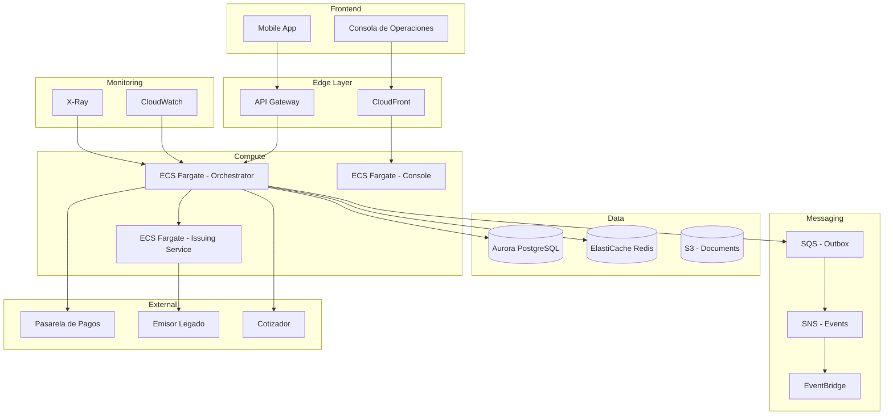

# Arquitectura AWS - Plataforma de Movilidad

## Diagrama de Arquitectura



## Justificación de Servicios

### Compute: ECS Fargate
**Por qué:** 
- Serverless containers = sin gestión de EC2
- Auto-scaling basado en requests/segundo
- Ideal para 10K órdenes/día con picos de 50 RPS
- Costo predecible vs Lambda para servicios de larga duración

### Mensajería: SQS + SNS
**Por qué:**
- SQS para outbox pattern (durable, at-least-once)
- SNS para fan-out a múltiples consumidores
- Dead letter queues nativas
- Integración nativa con Lambda para reconciliation jobs

### Persistencia: Aurora PostgreSQL
**Por qué:**
- Compatibilidad PostgreSQL (migración mínima)
- Auto-scaling de almacenamiento
- Read replicas para consultas de reporting
- Backup automático y point-in-time recovery

### Cache: ElastiCache Redis
**Por qué:**
- Session store para consola de operaciones
- Rate limiting distribuido
- Cache de cotizaciones (TTL corto)
- Pub/Sub para actualizaciones en tiempo real

## Infrastructure as Code (Terraform)

```hcl
# ecs-cluster.tf
resource "aws_ecs_cluster" "super_leader" {
  name = "super-leader-cluster"
  
  setting {
    name  = "containerInsights"
    value = "enabled"
  }
}

resource "aws_ecs_task_definition" "orchestrator" {
  family                   = "orchestrator"
  network_mode             = "awsvpc"
  requires_compatibilities = ["FARGATE"]
  cpu                      = "512"
  memory                   = "1024"
  
  container_definitions = jsonencode([
    {
      name      = "orchestrator"
      image     = "${aws_ecr_repository.orchestrator.repository_url}:latest"
      essential = true
      
      portMappings = [
        {
          containerPort = 8080
          hostPort      = 8080
        }
      ]
      
      environment = [
        {
          name  = "DATABASE_URL"
          value = "postgres://${aws_rds_cluster.master.username}:${aws_rds_cluster.master.password}@${aws_rds_cluster.master.endpoint}/super_leader"
        }
      ]
      
      logConfiguration = {
        logDriver = "awslogs"
        options = {
          "awslogs-group"         = "/ecs/orchestrator"
          "awslogs-region"        = "us-east-1"
          "awslogs-stream-prefix" = "ecs"
        }
      }
    }
  ])
}

resource "aws_ecs_service" "orchestrator" {
  name            = "orchestrator"
  cluster         = aws_ecs_cluster.super_leader.id
  task_definition = aws_ecs_task_definition.orchestrator.arn
  desired_count   = 2
  launch_type     = "FARGATE"
  
  network_configuration {
    security_groups  = [aws_security_group.ecs.id]
    subnets          = aws_subnet.private[*].id
    assign_public_ip = false
  }
  
  load_balancer {
    target_group_arn = aws_lb_target_group.orchestrator.arn
    container_name   = "orchestrator"
    container_port   = 8080
  }
}

# secrets.tf
resource "aws_secretsmanager_secret" "db_password" {
  name = "super_leader/db/password"
}

resource "aws_secretsmanager_secret_version" "db_password" {
  secret_id = aws_secretsmanager_secret.db_password.id
  secret_string = random_password.db_password.result
}

resource "random_password" "db_password" {
  length           = 32
  special          = true
  override_special = "!#$%&*()-_=+[]{}|:?"
}
```

## Secretos y Configuración

### Gestión de Secretos:
- **AWS Secrets Manager** para credenciales de BD y terceros
- **Rotation automático** cada 30 días para credenciales de BD
- **AWS Systems Manager Parameter Store** para configuración no sensible
- **IAM Roles** para acceso entre servicios (sin credenciales estáticas)

### Flujo de Rotación:
1. Secrets Manager genera nueva contraseña
2. Lambda actualiza Aurora
3. Notifica a ECS para reiniciar tareas
4. Verifica conectividad
5. Confirma rotación exitosa

## SLIs y SLOs

| SLI | SLO | Alerta | No Alerta |
|-----|-----|--------|-----------|
| **Disponibilidad API** | 99.9% uptime | < 99.5% en 5 min | Degradación < 1% por < 2 min |
| **Latencia P99** | < 500ms | > 1s por 3 min | > 700ms por < 1 min |
| **Error Rate** | < 0.1% requests | > 1% por 2 min | > 0.5% por < 5 min |

### Alertas que NO Configurar (para no crear ruido):
- CPU > 50% (normal en picos)
- Memory > 70% (normal con caching)
- Latencia > 200ms (depende de query)
- Requests < 10/min (puede ser patrón normal nocturno)

## Estimación de Costo Mensual

| Componente | Configuración | Costo/mes |
|------------|---------------|-----------|
| ECS Fargate | 2 tasks × 0.5 vCPU × 1GB | $60 |
| Aurora PostgreSQL | db.r5.large, Multi-AZ | $280 |
| ElastiCache Redis | cache.t3.medium, 2 nodes | $120 |
| API Gateway | 1M requests | $3.50 |
| SQS + SNS | 1M messages | $2 |
| S3 | 10GB storage | $0.50 |
| CloudWatch | Logs + Metrics | $50 |
| Secrets Manager | 5 secrets | $2.50 |
| **Total** | | **~$518/mes** |

### Primera Partida que se Dispara al Crecer 10x:

**Aurora PostgreSQL:** De $280 a ~$1,400/mes
- De db.r5.large a db.r5.4xlarge
- Read replicas adicionales
- Storage auto-scaling

**ECS:** De $60 a ~$600/mes
- De 2 a 20 tasks
- Auto-scaling activo

**Detección temprana:** Monitorear CPU/Prometheus metrics. Si el promedio supera 60%, escalar proactivamente.

## ¿Qué se Rompe Primero?

**El primer cuello de botella será la conexión a Aurora PostgreSQL.** Con 50 RPS y conexiones persistentes de ECS, el pool de conexiones se agotará antes que CPU o memoria.

**Cómo detectarlo antes de que un cliente lo note:**
1. **Métrica:** `DatabaseConnections` acercándose al límite de `max_connections`
2. **Síntoma:** Aumento de latencia en queries simples
3. **Solución inmediata:** PgBouncer como connection pooler
4. **Solución larga:** Aurora Serverless v2 con auto-scaling

**Monitoreo:**
```sql
SELECT count(*) FROM pg_stat_activity;
```
Si supera el 80% de `max_connections`, alertar.

## Consistencia y Borrado (Habeas Data)

### Flujo de Eliminación de Vehículo/Cliente:

1. **Solicitud de eliminación** → API recibe request
2. **Marcado lógico** → `deleted_at = NOW()` (no borrado físico)
3. **Propagación asincrónica:**
   - Aurora: Soft delete + anonymización de datos sensibles
   - Redis: Invalidación de cache
   - S3: Eliminación de documentos (con versionado para retention)
   - Analytics: Retención según política (máximo 5 años)
4. **Confirmación** → Email de confirmación al usuario

### Datos que NO se Borrán (por obligación legal):
- Transacciones financieras (5 años mínimo)
- Logs de auditoría (3 años)
- Datos para litigios pendientes

### Rezago:
- **Cache Redis:** Expiración automática (TTL)
- **Aurora:** Mantener 30 días post-eliminación para recovery
- **S3:** Lifecycle policy a Glacier después de 1 año
- **Analytics:** Anonimización, no eliminación

### Cumplimiento Habeas Data:
- Derecho de acceso: Exportación en JSON
- Derecho de rectificación: API de actualización
- Derecho de eliminación: Flujo descrito arriba
- Derecho de portabilidad: Exportación estándar
